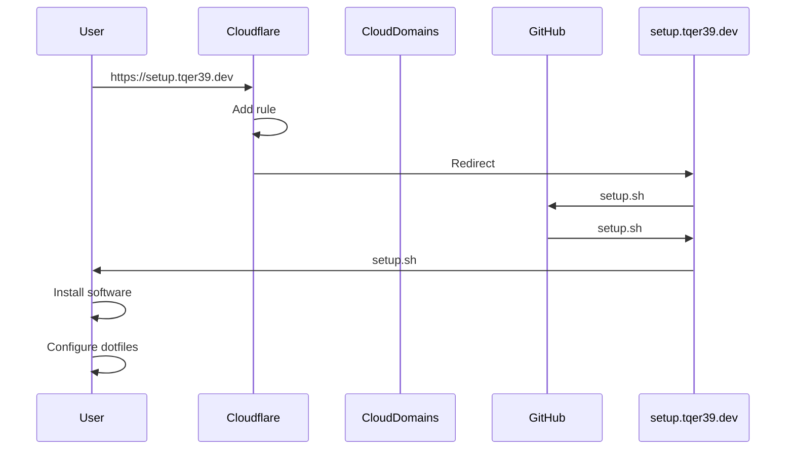

# Repository Description

This repository contains a shell script for provisioning a local development environment.

## Setup Instructions

```bash
curl -sL https://setup.tqer39.dev | bash
```

## High-Level Architecture

1. Acquire the `tqer39.dev` domain on Google Cloud Platform (GCP) Cloud Domains
2. Define the `tqer39.dev` domain in Cloudflare
   1. SSL/TLS is automatically issued
   2. Issue an NS record and set it in Cloud Domains
3. Add rules to Cloudflare and redirect to `setup` when accessing `https://setup.tqer39.dev/*`
4. When accessing `https://setup.tqer39.dev` with cURL, the `setup.sh` in this repository is loaded as plain text and executed with bash

### Sequence Diagram



## Setup Contents

### Installed Software

- [bat](https://github.com/sharkdp/bat)
- [Brave](https://brave.com/ja/)
- [exa](https://github.com/eza-community/eza)
- [fd](https://github.com/sharkdp/fd)
- [fzf](https://github.com/junegunn/fzf)
- [Git](https://git-scm.com/)
- [Google Chrome](https://www.google.com/intl/ja_jp/chrome/)
- [Homebrew](https://brew.sh/index_ja)
- [Hyper.js](https://hyper.is/)
- [jq](https://stedolan.github.io/jq/)
- [Rancher Desktop](https://rancherdesktop.io/)
- [ripgrep](https://github.com/BurntSushi/ripgrep)
- [ruff](https://github.com/astral-sh/ruff)
- [Starship](https://starship.rs/)
- [Visual Studio Code](https://code.visualstudio.com/)
- [zsh](https://www.zsh.org/)

### dotfiles

Place dotfiles using symbolic links.

- `.config/git/ignore`
- `.config/starship.toml`
- `.bash_profile`
- `.bashrc`
- `.gitconfig`
- `.hyper.js`
- `.zshrc`
