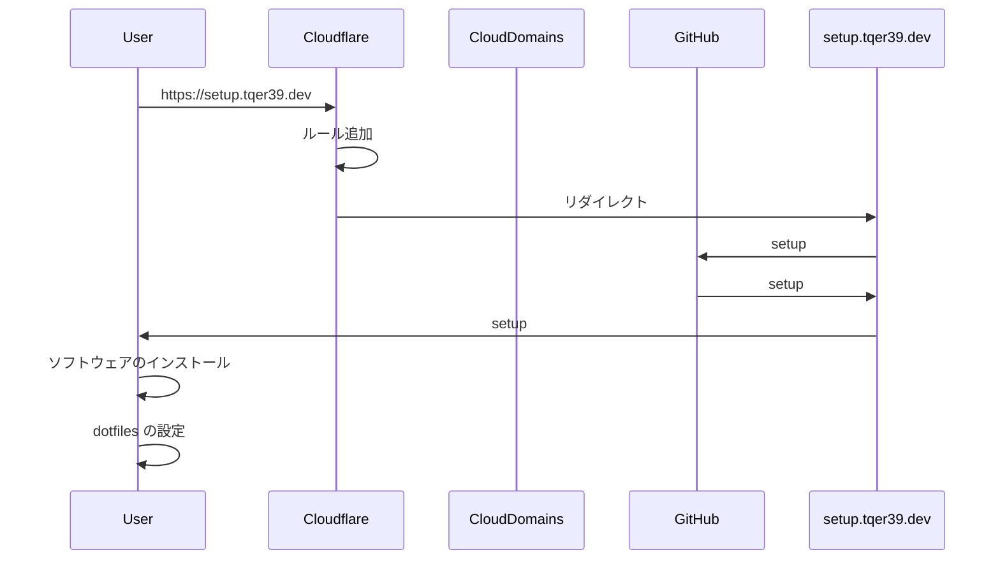

# このリポジトリの説明

ローカルの開発環境をプロビジョニングするための Shell スクリプトです。

## セットアップ方法

```bash
curl -sL https://setup.tqer39.dev | bash
```

`$HOME/workspace/local-workspace-provisioning` が配置されます。

## ハイレベルアーキテクチャ

1. Google Cloud Platform (GCP) の Cloud Domains で `tqer39.dev` のドメインを取得
2. Cloudflare で tqer39.dev のドメインを定義
   1. SSL/TLS が自動的に発行される
   2. NS レコードを発行して Cloud Domains に設定
3. Cloudflare のルールを追加し、`https://setup.tqer39.dev/*` へアクセスすると `setup` へリダイレクトさせる
4. cURL で `https://setup.tqer39.dev` へアクセスすると、このリポジトリの `setup` プレーンテキストで読み込まれ、bash で実行される

### シーケンス図



## セットアップ内容

### インストールされるソフトウェア

- [bat](https://github.com/sharkdp/bat)
- [Brave](https://brave.com/ja/)
- [exa](https://github.com/eza-community/eza)
- [fd](https://github.com/sharkdp/fd)
- [fzf](https://github.com/junegunn/fzf)
- [Git](https://git-scm.com/)
- [Google Chrome](https://www.google.com/intl/ja_jp/chrome/)
- [Homebrew](https://brew.sh/index_ja)
- [Hyper.js](https://hyper.is/)
- [jq](https://stedolan.github.io/jq/)
- [Rancher Desktop](https://rancherdesktop.io/)
- [ripgrep](https://github.com/BurntSushi/ripgrep)
- [ruff](https://github.com/astral-sh/ruff)
- [Starship](https://starship.rs/)
- [Visual Studio Code](https://code.visualstudio.com/)
- [zsh](https://www.zsh.org/)

### dotfiles

symbolic link で dotfiles を配置します。

- `.config/git/ignore`
- `.config/starship.toml`
- `.bash_profile`
- `.bashrc`
- `.gitconfig`
- `.hyper.js`
- `.zshrc`

## Contributing

### ローカルでの開発

```bash
git clone https://github.com/tqer39/local-workspace-provisioning
cd local-workspace-provisioning
git fetch -p
git switch -c feature/branch-name

pre-commit install --install-hooks
```
